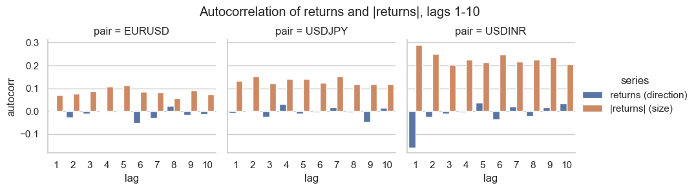
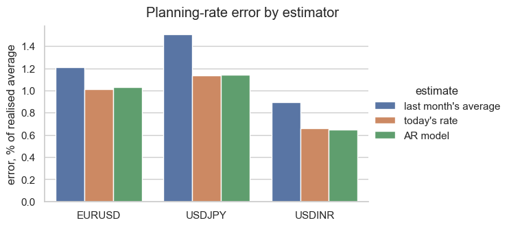
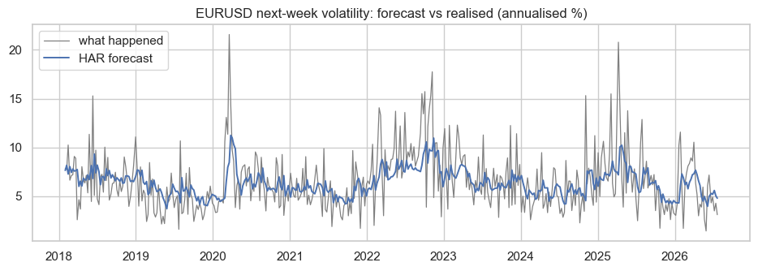
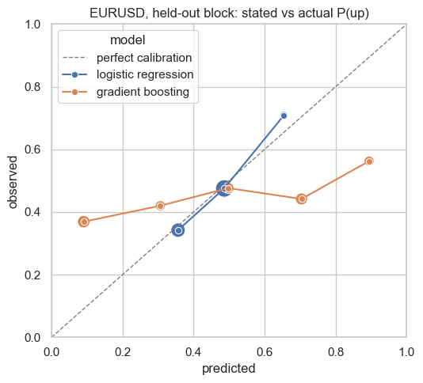
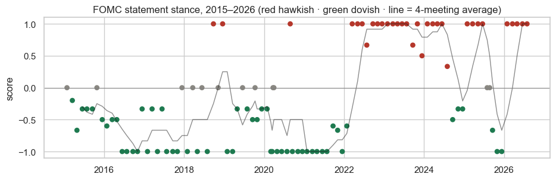

# Which currency questions are actually answerable?

Ten years of daily prices for three currency pairs: EURUSD (euro vs dollar),
USDJPY (dollar vs yen) and USDINR (dollar vs rupee). Three questions asked of
the same data. Two turned out to be dead ends. One gives a genuinely useful
answer.

| # | Question | Answer |
|---|---|---|
| 01 | Which way will the rate move next? | **No — nothing beat simple guessing** |
| 02 | How rough will next week be? | **Yes — forecast error cut roughly in half** |
| 03 | What rate should a business plan next month around? | **Use today's rate, not last month's average — 16–28% less error** |

The full analysis is in two notebooks:
[`notebooks/01_direction.ipynb`](notebooks/01_direction.ipynb) (question 1) and
[`notebooks/02_volatility_and_planning.ipynb`](notebooks/02_volatility_and_planning.ipynb)
(questions 2 and 3). Everything below is the short version.

---

## The data

All inputs are free and public, and they are stored in this repo so everything
runs offline: daily prices from Yahoo Finance (2015 onward), interest rates and
inflation from FRED (the US Federal Reserve's public database), weekly trading
positions of large funds from the CFTC (a US regulator), and the Federal
Reserve's own policy statements.

One bug is worth telling as a story. Yahoo timestamps its currency prices
earlier in the day than the dollar index (a single number tracking the dollar
against a basket of currencies). Join the two on the same date and "today's"
dollar move secretly contains information about *tomorrow's* euro move. The
check that caught it uses correlation — a score from −1 to +1 where near 0
means "no connection" and near −1 or +1 means "strongly connected":

```python
corr(dollar_move_today, euro_move_today)     # -0.09  -> no connection, as expected
corr(dollar_move_today, euro_move_tomorrow)  # -0.87  -> strong connection = a leak from the future
```

Before the fix, one model looked 70% accurate. After shifting the data by one
day, that advantage vanished. Every result below is from the fixed data.

---

## One chart that explains the whole study

A simple question of the price history: "does what happened in the last few
days tell you anything about today?" Asked twice — once about the *direction*
of moves (blue), once about the *size* of moves (orange). Bar height = how much
predictive information exists. Zero = none.



*Chart-label translation: "returns" = direction of moves, "|returns|" = size of
moves, "lag" = how many days back you look, "autocorr" = the bar height, i.e.
how much predictive information there is.*

The blue bars sit at zero: yesterday's direction tells you nothing about
today's. (One blue bar on the rupee panel dips below zero — the rupee tends to
give back a little the day after a move — but it is too small and short-lived
to build on, and the models confirmed that.) The orange bars are clearly
positive on every pair: wild days follow wild days, calm days follow calm
days. In plain terms — **the market hides
which way it will move, but telegraphs how rough the ride will be.** That is
why question 1 fails and question 2 works.

---

## Question 3 first, because it's the useful one

Businesses constantly need one exchange rate agreed in advance: a budgeting
rate, a pricing rate, a rate written into a contract. What that number is
really trying to guess is **next month's average rate**.

We compared three ways of setting it, at every month-end for 104 months. The
score is simple: on average, how far off was the guess, as a percentage?
Smaller is better.

| Pair | Guess A: reuse last month's average | Guess B: use today's rate | Guess C: a small statistical model | B vs A |
|---|---|---|---|---|
| EURUSD | off by 1.21% | **off by 1.01%** | off by 1.03% | 16% less error |
| USDINR | off by 0.90% | off by 0.66% | **off by 0.65%** | 28% less error |
| USDJPY | off by 1.51% | **off by 1.13%** | off by 1.14% | 25% less error |



*Chart-label translation: "last month's average" = Guess A, "today's rate" =
Guess B, "AR model" = Guess C. (The chart orders the pairs differently than the
table.)*

Guess A is the common habit: last month's average goes into next month's plan.
Guess B — just use whatever the rate is today — beats it on every pair. Guess C
(a model that continues recent price behaviour forward) does **not** beat guess B,
which is the punchline: **the win comes from picking a better starting point,
not from modelling.**

The takeaway a company can act on: *when setting next month's planning rate,
use today's rate, not last month's average.* Free, no model, and it held on
all three pairs. (Code: [`scripts/14_period_average.py`](scripts/14_period_average.py))

---

## Question 2: how rough will next week be?

"Volatility" just means how much the price jumps around — a calm week vs a
wild one. Knowing next week will be wild doesn't say which way prices go, but
it tells a business how much safety margin to leave: buy protection sooner,
charge customers a bigger buffer, put less money at stake that week.

Two forecasters were compared, one week ahead, on 426 separate weeks per pair:

- **The do-nothing guess:** assume next week is as wild as the recent past.
- **The volatility model:** a standard statistics-textbook recipe (called HAR)
  that combines yesterday's, last week's and last month's choppiness into one
  forecast. Nothing exotic — it's a weighted average with weights learned from
  history.

Result: **the model cuts the forecast error roughly in half on every pair** —
51–57% less error, measured by the scoring rule statisticians use for
volatility forecasts (it punishes under-warning about a storm more than
over-warning about one). Exact numbers:
[`turbulence_har.csv`](outputs/case_study/tables/turbulence_har.csv).

Here is what that looks like for the euro. The gray line is how wild each week
*actually* turned out to be. The blue line is what the model *predicted one
week earlier*. The forecast is useful because the two lines track each other —
the model sees the storms coming, at least roughly:



*Chart-label translation: the vertical axis ("annualised %") is just the
roughness scale — higher = wilder week. Gray = what happened, blue = the
forecast made a week earlier.*

One more finding, reported because negative results count: we also tried
stacking machine learning (computer models that hunt for patterns on their
own) on top of the simple recipe. It made the forecasts **worse** in five of
six tests. More complexity is not more accuracy.

(Code: [`scripts/10_turbulence_har.py`](scripts/10_turbulence_har.py), notebook 2)

---

## Question 1: which way will the rate move? (the dead end)

Fifteen different approaches were tested — classic trading rules, several
machine-learning models, and combinations of them. Every one was compared
against the laziest possible guess: *"the next period repeats the last one."*

None of them beat it convincingly. Accuracy here is scored out of 100, so
"+6.4" means the best model was right about 6 more times per 100 guesses than
lazy guessing. In every case that advantage was smaller than the uncertainty
around it — it could easily be luck:

| Pair | Extra correct guesses per 100, vs lazy guessing | Could it just be luck? |
|---|---|---|
| EURUSD | +6.4 | Yes — too close to call |
| USDJPY | +1.6 | Yes |
| USDINR | +1.4 | Yes |

One genuinely useful thing did come out of the failure. Some models state a
confidence with each guess ("70% sure it goes up"). We checked whether those
confidences are honest — when a model says 70%, is it right about 70% of the
time?



*Chart-label translation: "P(up)" = the model's stated chance the rate goes up;
"held-out block" = the final stretch of data, kept hidden while the models
were learning from history.*

Read it like this: each dot is a batch of predictions; left-right is what the
model *claimed*, up-down is what *actually happened*; the dashed diagonal is
where an honest model's dots would sit. The simple model (logistic regression)
sits near the line — its confidence means something. The fancy model (gradient
boosting) is far off it: when it said "90% sure", it was right barely half the
time. **A model can look fine on accuracy and still be dangerously
overconfident — you only see it if you check.**

We also tested whether the US Federal Reserve's policy statements help predict
the rate. The Fed's rate-setting committee (the FOMC) publishes a statement
after each meeting; we scored all 99 of them from hawkish (leaning toward
higher interest rates) to dovish (leaning toward rate cuts):



*In the chart: red dots = hawkish statements, green = dovish, gray = neutral;
the score runs from −1 (fully dovish) to +1 (fully hawkish).*

The scoring itself works — the 2022–23 rate-hike era reads hawkish, the 2020
emergency cuts read dovish. But feeding those scores to the models changed
nothing: predictions got no better. Tested, rejected, and kept in the repo as
a documented negative. (Code: [`scripts/12_stance_score.py`](scripts/12_stance_score.py),
[`scripts/13_stance_ablation.py`](scripts/13_stance_ablation.py))

---

## How the testing was kept honest

- **Every model raced a named "lazy" baseline** — beat that or it doesn't count.
  Most of this study's value came from choosing the right baseline.
- **Models were always tested on data they had never seen**, sliding forward
  through time the way real forecasting works.
- **Every headline claim carries a statistical uncertainty range** and a stated
  sample size; small samples are called anecdotes, not results.
- **Everything regenerates from the code here** — data, tables and every chart
  above. Start with the two notebooks.

Known limits: only three currency pairs; roughness measured from end-of-day
prices (minute-by-minute data would be more precise); no trading costs modelled — this is about
forecast quality, not a trading strategy, and nothing here is investment
advice. Full detail: [`outputs/case_study/FINDINGS.md`](outputs/case_study/FINDINGS.md).

## Run it yourself

```bash
uv sync
uv run pytest                              # 83 tests
uv run python scripts/16_check_data.py     # validates every stored data file
uv run jupyter lab notebooks/
```

## License

MIT. See `LICENSE`.
